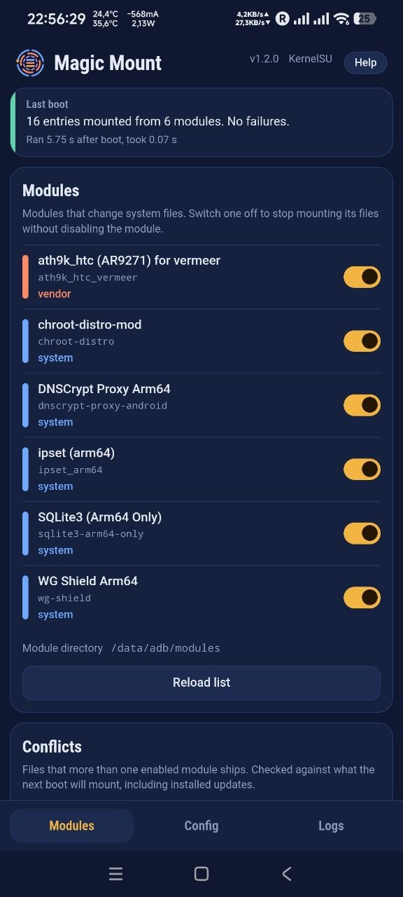

# Magic Mount (meta-mm)

A Magic Mount metamodule for KernelSU (and its forks) and APatch. At boot it
takes the `system/`, `vendor/`, `product/`, `system_ext/` and `odm/` files of
every other module, plus any extra partitions you add, and makes them appear
on the device with bind mounts over an in-memory (tmpfs) mirror. The real
partitions are never changed: turn a module off, reboot, and its files are
gone.

<p align="center"></p>

## Features

- **Conflicts card** — shows which modules ship the same file and which copy
  is used, checked against what the next boot will mount. One tap makes the
  other module win.
- **Stable mount order** — preferred modules first, then by module ID, so the
  same module wins at every boot.
- **Per-module switch** — stop mounting one module's files without disabling
  it (its scripts, props and sepolicy still apply); survives module updates.
- **Last boot card** — what was mounted, failures, and whether Magic Mount ran
  during this boot at all.
- **Logs, configuration and help** in the WebUI; everything is also plain
  text under `/data/adb/magic_mount`.
- **KernelSU umount support** — mounts are registered so they can be removed
  for apps you choose in the manager.
- **Safe by design** — runs once per boot, never blocks boot, and a problem
  with one module does not stop the others.

## Install

1. Download `meta-magic_mount-<version>-release.zip` from
   [Releases](https://github.com/nikakvo/meta-magic_mount/releases).
2. Install it in KernelSU / APatch and reboot. It replaces a previously
   installed metamodule (that one is removed at the next reboot).
3. Updates are offered in the manager.

Your configuration and the WebUI switches live in `/data/adb/magic_mount` and
are kept across updates and reinstalls.

## Credits and license

Original Magic Mount metamodule and C core by **7a72**, with contributions
from backslashxx, lamprose, Prslc and others. The original repository and
update server no longer exist; this project continues from the surviving copy
at `github.com/hamjin/meta-magic_mount` (upstream `62ae7f0`). Maintained by
**Tears Burn (nikakvo)**.

Licensed under the [GNU General Public License v3.0](LICENSE).

## Mount order and conflicts

`mmd` collects every enabled module (no `disable`, `remove` or `skip_mount`)
and sorts them: modules listed in `priority=` (mm.conf) first, in that order,
then the rest by module ID. When two modules ship the same path, the first one
in this order wins; the other copy is ignored and recorded as a conflict
(`file`, `same`, `type`, `replace`). Conflicts are logged as warnings at boot.

`mmd --dry-run` builds the same tree without mounting and prints a
tab-separated report (`order`, `conflict`, `unreadable`, `result` lines). It
reads installed updates from `modules_update/`, so it describes the next boot.
The WebUI's Conflicts card is built from it. `mmd` is not on the system path;
run it as root with the full path:

```sh
su -c '/data/adb/modules/meta-mm/mmd --dry-run'
su -c '/data/adb/modules/meta-mm/mmd --version'
```

Partition links of KernelSU's default layout (`system/vendor -> ../vendor`)
are followed while collecting `system/`, so modules in either layout merge.

## What it does at boot (`metamount.sh`)

0. Exits at once if `status` already belongs to this boot (once per boot).
1. Rotates `mm.log` to `mm.log.old` and, with it, copies `status` to
   `status.old` (so `status.old` always describes the boot that wrote
   `mm.log.old`; when the log is not rotated, `status.old` is removed).
2. Re-applies the WebUI's "mounting off" choices (`skip_mount.list`) —
   KernelSU drops `skip_mount` when a module is updated.
3. Records what this boot sees: `boot_state` (every module: on / skip /
   disable / remove) and `boot_config` (copy of `mm.conf`).
4. Runs `mmd`, then writes `status` (boot id, result, exit code, timing).
5. Always exits 0 — a mount problem never blocks boot.

`service.sh` then waits for `sys.boot_completed=1` and a set clock (later than
2026-01-01, the install time of the module and the previous boot's start;
at most 10 minutes) and appends `boot_start=<epoch s>` to `status`. The WebUI
uses it for the previous boot's "Written" time; file mtimes are useless because
`mm.log` is written before Android sets the clock.

The WebUI compares the current files with these records, so it always knows
which changes are still waiting for a reboot.

## Files

| Path | Purpose |
|------|---------|
| `/data/adb/modules/meta-mm/` | module (`mmd`, scripts, `webroot/`, `aok`) |
| `/data/adb/magic_mount/mm.conf` | configuration (kept across reinstalls), incl. `priority=` |
| `/data/adb/magic_mount/mm.log`, `mm.log.old` | this boot / previous boot |
| `/data/adb/magic_mount/status` | last run: boot id, result, exit code, timing, `boot_start` |
| `/data/adb/magic_mount/status.old` | the same for the boot that wrote `mm.log.old` |
| `/data/adb/magic_mount/boot_state` | module states seen at the last run |
| `/data/adb/magic_mount/boot_config` | config used at the last run |
| `/data/adb/magic_mount/skip_mount.list` | modules switched off in the WebUI |

`skip_mount` files **not** on the list (shipped by a module author) are never
touched by the scripts. Uninstalling Magic Mount removes only the
`skip_mount` files on the list, then `/data/adb/magic_mount`.

## Build (WSL)

Needs `git`, `make`, `zip`, `zig` 0.14+ (`pip install ziglang` plus a `zig`
wrapper running `python3 -m ziglang "$@"`), `node` and `pnpm` 10.

```sh
git clone https://github.com/nikakvo/meta-magic_mount.git
cd meta-magic_mount
bash build.sh         # WebUI + tests + binaries -> build/*-release.zip
```

Run it with `bash` (the file is not marked executable in the repository).
The version comes from the latest git tag; uncommitted changes add `-dirty`.

| Option | |
|--------|-|
| (none), `--release` | release zip |
| `--debug` | debug zip (unstripped, `-O0 -g`) |
| `--all` | both |
| `--skip-webui` | package the existing `template/webroot` |
| `--skip-tests` | skip the tests |

Version = latest tag, versionCode = `git rev-list --count HEAD` (override with
`VERSION_CODE=…`). `build/changelog.md` is the tag's section of
`CHANGELOG.md`, used as the release notes; keep CHANGELOG entries to what
users of the module notice.

### Releasing

The module checks for updates through `update.json` in the repository root
(`updateJson` points at its raw URL on `main`). A release build from a clean
tag writes a ready `build/update.json`.

1. Add a `## vX.Y.Z` section at the top of `CHANGELOG.md`, commit, `git tag vX.Y.Z`.
2. `VERSION_CODE=<n> bash build.sh` (`<n>` = the new versionCode), test the zip.
3. Create the GitHub release `vX.Y.Z`: paste `build/changelog.md` as the
   notes and upload `build/meta-magic_mount-vX.Y.Z-release.zip`.
4. Replace `update.json` in the repository root with `build/update.json`.

### Tests

`build.sh` runs both before building:

```sh
make -C src check          # mmd --dry-run on sample module folders (no root)
cd webui && pnpm test      # pure WebUI logic (src/lib/parse.js)
```

WebUI development in a desktop browser with fake data:

```sh
cd webui && pnpm install && pnpm dev    # http://localhost:5173/?mock=ok|pending|stale|failed|fresh|many|conflicts
```

Pure logic lives in `webui/src/lib/parse.js` (no device access).
